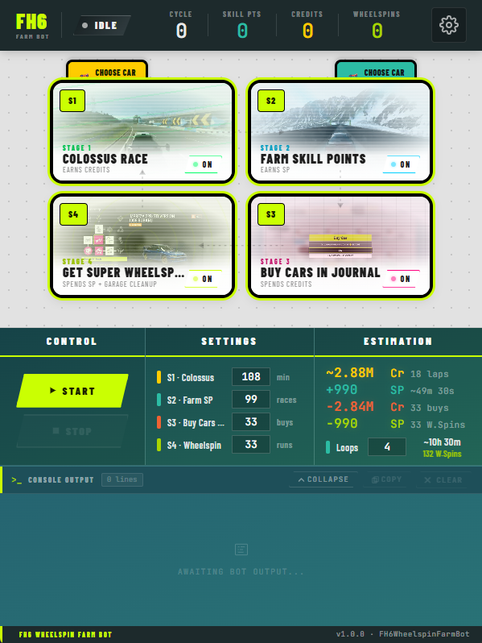

# Forza Horizon 6 Wheelspin Farm Bot



A fully automated, 100% AFK bot for farming Super Wheelspins, Credits, and Skill Points in Forza Horizon 6.

## The Auto-Farming Cycle

The bot runs on a continuous, fully automated 4-stage loop that handles the entire farming process AFK, compiling the best legal farming methods discovered by the community to date:

```
┌────────────────────────────────────┐      ┌────────────────────────────────────┐
│ Stage 1: Colossus Autopilot        │      │ Stage 2: Eventlab farm map         │
│ Farm credits.                      │─────>│ Farm SP.                           │
└────────────────────────────────────┘      └────────────────────────────────────┘
                    ▲                                       │
                    │                                       │
                    │                                       ▼
┌────────────────────────────────────┐      ┌────────────────────────────────────┐
│ Stage 4: Unlock Super Wheelspins   │      │ Stage 3: Buy cars in journal       │
│ Spend SP on Subaru's 22B + Cleanup │<─────│ Spend credits. Bulk buy Subaru 22B │
└────────────────────────────────────┘      └────────────────────────────────────┘
```

## Prerequisites

To run the bot, your system needs the following components:

* **WebView2 Runtime** (used for rendering the user interface)
* **ViGEmBus Driver** (required for virtual controller emulation)

> [!NOTE]
> If either of these dependencies is missing, the bot will automatically detect it and prompt you to install them upon startup.

## Getting Started

1. Set your Forza Horizon 6 to **Windowed** or **Borderless** mode (2560x1440 or 1920x1080 is recommended).
2. **Lock your game framerate to 60 FPS** and ensure a stable 60 FPS. If FPS drops to 30-40 or below, the bot's keystrokes and inputs may not register properly.
3. Launch the bot executable.
4. Complete **Initial Setup** guide in the bot's UI on launch.
5. In game, enter the **Open World**, open the **Pause Menu**, and make sure you are on the **first tab**.
6. Click **Start** and let the bot do the work!

## Ban Risk & Safety Measures

Using any bot violates the game's Terms of Service and carries a risk of suspension or ban. Use this tool at your own risk.

> [!TIP]
> **Safety Recommendation**: Do not run the bot for more than 12 consecutive hours at a time to minimize detection risk.

To minimize detection, the bot mimics human playstyles with advanced input simulation:

* **Controller Emulation**: Emulates a real Xbox 360 controller via the ViGEmBus driver, making the bot appear as physical hardware rather than automated software.
* **Human-like Timing**: Randomizes button holds and menu delays using human-like response distributions.
* **Smooth Movements**: Uses the Ruckig library for smooth analog stick and trigger transitions instead of instant snaps.
* **Micro-tremors**: Adds subtle, organic micro-vibrations to joysticks to simulate natural hand tremors.
* **Overshooting & Corrections**: Simulates realistic human errors by occasionally overshooting targets slightly before correcting.