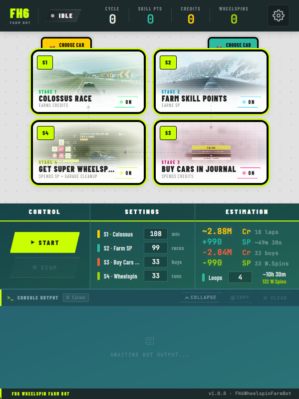

# Forza Horizon 6 Wheelspin Farm Bot



Automated farming bot for Super Wheelspins, Credits, and Skill Points in Forza Horizon 6. Built with a Tauri 2 shell (SvelteKit frontend, Rust backend), shipped as a single native Windows executable (`FH6WheelSpinFarmBot.exe` / `FH6WheelSpinFarmBot-Pro.exe`).

---

## Prerequisites

| Dependency           | Purpose                                          |
| -------------------- | ------------------------------------------------ |
| **WebView2 Runtime** | Renders the SvelteKit UI inside the Tauri window |
| **ViGEmBus v1.22.0** | Virtual Xbox 360 controller kernel driver        |

If either dependency is absent on first launch, the bot detects it and offers guided installation. For ViGEmBus, the bot can auto-download the official installer (`ViGEmBus_1.22.0_x64_x86_arm64.exe`) from the Nefarius GitHub release via PowerShell `Invoke-WebRequest`, then runs it directly.

---

## Getting Started

1. Set Forza Horizon 6 to **Windowed** or **Borderless Windowed** mode. Recommended: **2560×1440** or **1920×1080**.
2. **Lock the framerate to 60 FPS.** Input timing is calibrated for 60 FPS; lower framerates will cause game-state detections and input sequences to misfire.
3. Launch `FH6WheelSpinFarmBot.exe` (Free) or `FH6WheelSpinFarmBot-Pro.exe` (Pro).
4. Complete the **Initial Setup** walkthrough in the UI.
5. In game, enter the **Open World**, open the **Pause Menu**, and ensure you are on the **first tab**.
6. Click **Start**.

---

## Architecture

```
┌─────────────────────────────────┐
│  SvelteKit UI  (WebView2)       │   Tauri IPC commands:
│  +page.svelte                   │   start_bot / stop_bot / pause_bot /
│  Real-time log + stats panel    │   resume_bot / update_config /
└────────────────┬────────────────┘   run_gamepad_test / run_cv_diagnostics
                 │ Tauri invoke / emit
┌────────────────▼────────────────┐
│  Tauri host  (src-tauri/src/)   │
│  BotState: Arc<BotFSM>          │
└────────────────┬────────────────┘
                 │
┌────────────────▼────────────────┐
│  core-bot  (Rust library crate) │
│  state_machine · stages ·       │
│  vision · controller · capture  │
│  config · playback              │
└─────────────────────────────────┘
```

The bot backend (`core-bot`) is a separate Rust workspace crate. It runs the farm loop on a dedicated background thread spawned by `BotFSM::start()`. The Tauri host holds `Arc<BotFSM>` in Tauri managed state. The UI receives live updates via Tauri `emit("status", …)` and `emit("log", …)` events pushed from the background thread.

---

## Auto-Farming Cycle

The bot executes a configurable 4-stage loop. Each stage is individually toggleable; skipped stages are handled by the transition table in `get_next_stage_transition()` so the loop always progresses consistently.

```
┌────────────────────────────────────┐      ┌────────────────────────────────────┐
│ Stage 1: Colossus Autopilot        │      │ Stage 2: Eventlab farm map         │
│ Farm credits.                      │─────>│ Farm SP.                           │
└────────────────────────────────────┘      └────────────────────────────────────┘
                    ▲                                       │
                    │                                       │
                    │                                       ▼
┌────────────────────────────────────┐      ┌────────────────────────────────────┐
│ Stage 4: Unlock Super Wheelspins   │      │ Stage 3: Buy cars in journal       │
│ Spend SP on Subaru 22B + Cleanup   │<─────│ Spend credits. Bulk buy Subaru 22B │
└────────────────────────────────────┘      └────────────────────────────────────┘
```

### Stage 1 — Colossus Autopilot (credit farming)

The bot navigates to the Colossus race via the pause menu map, sets the race difficulty to the maximum payout configuration (D-pad Down → A → A → D-pad Down → hold D-pad Right 2 s → D-pad Left → Start to save), launches the race, then immediately activates the in-game autopilot (D-pad Down + D-pad Left). A polling loop runs every second checking two signals:

- **Template match** — `autopilot_driving.png` / `autopilot_driving_disabled.png` via two-pass NCC at ≥0.80 threshold (see [Vision](#vision--template-matching)).
- **Color check** — `check_autopilot_color()` samples the matched bounding box for OpenCV-HSV green pixels (H∈[80,105], S≥80, V≥80) at ≥8% of total pixels. Green means active; grey means the in-game AI has stalled.

If the autopilot icon is present but grey, the bot re-sends the D-pad Down + D-pad Left activation sequence. If no driving HUD is detected for 15 consecutive seconds, `attempt_recovery()` fires (see [Error Recovery](#error-recovery)).

Driving time accrues to `session_driving_seconds`; every 345 s of tracked drive time adds 160,000 credits to the session counter. Duration is controlled by `stage1_duration` (units: 6-minute laps). After the timer expires, the bot opens the pause menu, selects "Quit to Freeroam", and confirms open-world return by matching `autopilot_icon.png` at ≥0.80 NCC.

### Stage 2 — Eventlab Skill Points farm

The bot loads a specific Eventlab map optimised for skill point generation and runs it a configurable number of times (`stage2_iterations`). A difficulty setup flow runs before the first iteration to configure the race consistently. Each iteration uses a randomly-selected pre-recorded controller session from the playback library (see [Playback System](#playback-system)). Race finish is confirmed by matching `stage2_finish_banner.png` / `stage2_post_finish.png`. Each successful iteration credits +10 SP to the session counter.

### Stage 3 — Buy Subaru 22B in the Collection Journal

The bot opens the Collection Journal via the pause menu, opens the manufacturer brand filter, and navigates to Subaru. Brand navigation is vision-guided: `find_template()` locates the Subaru logo (`journal_subaru_brand.png`) and `calculate_brand_navigation_offsets()` computes the D-pad step delta from the current cursor position to Subaru's grid cell. The bot then buys `stage3_iterations` copies of the Subaru Impreza 22B (~86,000 credits each), using `journal_subaru_22b.png` / `journal_subaru_22b_selected.png` template matching to confirm selection.

### Stage 4 — Spend SP on the 22B Talent Tree

The bot opens the Spend SP menu, selects the Subaru 22B, and purchases skill nodes. Per-cell state is determined by sampling a 50×50 px region around each node's grid center (grid origin: 500 px, 320 px; cell size: 154×154 px) and evaluating pixel HSV ratios:

| HSV range                      | Ratio threshold | State       |
| ------------------------------ | --------------- | ----------- |
| H∈[140,175], S≥80, V≥80 (pink) | >12%            | `Purchased` |
| S≤45, V≥195 (white)            | >15%            | `Available` |
| Neither                        | —               | `Locked`    |

The bot purchases all available nodes per iteration. After all SP iterations complete, `run_garage_cleanup()` sells the accumulated 22B cars to prevent garage overflow. The number of purchased cars (Stage 3) always equals `stage4_iterations`, enforced by `BotConfig::resolve_conflicts()`.

---

## Virtual Controller & Human-Motion Emulation

All game inputs are sent through ViGEmBus via the `vigem-client` crate as an Xbox 360 Wired controller (`TargetId::XBOX360_WIRED`). No keyboard or mouse injection is used at any point.

### Synthesised motion (`controller.rs`)

Button presses and analog stick movements are not instant digital signals. Every input is shaped through two layers:

**1. Ruckig OTG trajectories** (`rsruckig` crate) — Generates time-optimal, jerk-limited motion profiles. `ruckig_move()` derives velocity/acceleration/jerk limits from a lognormally-sampled human reaction time (100–250 ms range). `move_stick()` additionally introduces a 35% probability overshoot: the stick moves 2–20% past the target, holds briefly, then corrects back — matching the natural overshoot pattern of human gamepad input.

**2. OpenSimplex noise tremor** — A persistent `OpenSimplex` field (randomly seeded at startup, advanced by `dt × 10` per sample) adds correlated micro-noise (amplitude ≈ 0.005–0.008 normalised units) to every stick and trigger update at 5–10 ms intervals.

### Inter-input timing (`HumanTiming`)

All delays between inputs are sampled from lognormal distributions. Parameters per timing class:

| Class          | σ    | Scale (ms) | Floor (ms) | Usage                                  |
| -------------- | ---- | ---------- | ---------- | -------------------------------------- |
| `BUTTON_HOLD`  | 0.15 | 70         | 50         | Button press duration                  |
| `BUTTON_GAP`   | 0.45 | 160        | 60         | Gap after button release               |
| `NAV_PAUSE`    | 0.50 | 10         | 60         | Pause between sequential D-pad presses |
| `STAGE_JITTER` | 0.30 | 800        | 500        | Delay between major actions            |
| `THINK_PAUSE`  | 0.40 | 1800       | 500        | Simulated decision latency             |

### Recorded trigger/stick playback (`playback.rs`)

For race driving, the bot replays from a library of 201 binary recordings captured from real human controller sessions (stored as `.bin` files — 7× `f32` per 28-byte sample: `dt, lx, ly, rx, ry, lt, rt`). At playback:

- One recording is selected at random from 5–6 variants per action key (e.g. `stick_left_x_neg_fast`).
- A ±10% time-scale jitter and ±6% amplitude jitter are applied independently.
- Per-sample OpenSimplex noise (σ ≈ 0.007) is added to all four stick axes.
- Y-axes are negated to match XInput convention: `ly_raw = ((-ly) * 32767) as i16`.

---

## Vision / Template Matching

Screen capture uses `dxgi-capture-rs` (DXGI Desktop Duplication API), cropped to the game client area via `GetClientRect` + `ClientToScreen` Win32 calls, with `DwmGetWindowAttribute(DWMWA_EXTENDED_FRAME_BOUNDS)` as a fallback. On DXGI timeout (no new frame), the last captured `RgbImage` is returned.

Template matching runs a **two-pass NCC (Normalized Cross-Correlation)** implemented from scratch in `vision.rs` (no OpenCV dependency):

**Coarse pass** — Templates and the search region are downsampled by 2×, 4×, or 8× depending on the smallest template dimension. NCC is computed over downsampled images using an `IntegralImage` (sum and sum-of-squares tables) for O(1) patch-mean and patch-variance lookups. The inner cross-correlation loop uses raw pointer arithmetic in an `unsafe` block for SIMD-friendly integer accumulation. Candidates above `threshold − 0.15` pass through coarse NMS (4 px suppression radius, up to 20 kept).

**Fine pass** — Each coarse candidate is refined at full resolution in a ±coarse_factor pixel window, reusing a separate full-resolution `IntegralImage`.

All templates are compiled into the binary via `include_bytes!`. The scale factor `frame_h / baseline_h` is applied to both the template dimensions and any search region coordinates, so 1920×1080 and 2560×1440 are handled without separate template sets.

Many templates register multiple candidate variants via `get_template_candidates()`. For example, a single `find_template(frame, "journal_subaru_brand", …)` call checks both `journal_subaru_brand.png` and `journal_subaru_brand_2.png` and returns the best match across all candidates.

The per-frame grayscale conversion uses a thread-local `GRAY_CACHE` keyed on pointer identity, dimensions, and a 12-byte pixel fingerprint to avoid redundant conversions when the same `RgbImage` is matched against multiple templates in the same polling tick.

---

## Error Recovery

Navigation failures trigger an automatic recovery procedure, up to 5 attempts per failed navigation stage:

1. Grab the current frame and check for the pause menu (`pause_menu.png` / `pause_menu_1st_page.png` at ≥0.85 NCC). If detected, press B to return to driving.
2. Press A (dismiss possible loading dialogs).
3. Press B up to 3 additional times, checking for a healthy driving HUD after each press.

A "healthy" state is defined by `check_driving_hud()` — either `autopilot_driving_disabled.png` or `autopilot_driving.png` matching at ≥0.80 NCC. If recovery succeeds, the failed navigation stage is retried from the beginning. After 5 consecutive failed recovery attempts, the FSM transitions to `Error` state, emits an `error` event to the UI, and halts.

Throughout all waits, `smart_sleep()` checks the stop/pause flags every 50 ms, so Pause and Stop commands take effect promptly even mid-stage.

---

## FSM States

| State             | Meaning                                                                                                                          |
| ----------------- | -------------------------------------------------------------------------------------------------------------------------------- |
| `Idle`            | No loop running. Ready to start.                                                                                                 |
| `Running`         | Between stages (navigating or cycle bookkeeping).                                                                                |
| `Stage1`–`Stage4` | Actively executing a named stage.                                                                                                |
| `Paused`          | Loop suspended mid-stage. Controller inputs zeroed via `pause_inputs()`, which sends an all-zeros `XGamepad` update to ViGEmBus. |
| `Stopping`        | Stop requested; waiting for the background thread to join before resetting to `Idle`.                                            |
| `Error`           | Unrecoverable stage failure. Requires manual restart.                                                                            |
| `TestInputs`      | Running the controller diagnostic sequence.                                                                                      |

Each stage reports a `sub_state` string (e.g., `"Driving (Autopilot)"`, `"In Map Menu"`, `"Difficulty Settings"`) that is broadcast alongside the main state to the UI for live display.

---

## Configuration

Config is serialised as JSON to `%APPDATA%\com.forzawsfb.app\config.json` and loaded on startup.

| Field                 | Type                    | Default                | Description                                          |
| --------------------- | ----------------------- | ---------------------- | ---------------------------------------------------- |
| `stages_enabled`      | `HashMap<String, bool>` | all `true`             | Toggle individual stages                             |
| `loop_count`          | `i32`                   | `0` (infinite)         | Number of full 4-stage cycles before stopping        |
| `stage1_duration`     | `i32`                   | `6`                    | Colossus race time in minutes                        |
| `stage2_iterations`   | `i32`                   | `2`                    | Eventlab runs per cycle                              |
| `stage3_iterations`   | `i32`                   | `2`                    | Cars to bulk-buy per cycle                           |
| `stage4_iterations`   | `i32`                   | `2`                    | SP spend iterations per cycle (≤33)                  |
| `smart_settings`      | `bool`                  | `true`                 | Auto-resolve inter-stage parameter conflicts on save |
| `baseline_resolution` | `(u32, u32)`            | `(2560, 1440)`         | Template scaling reference                           |
| `stage1_car`          | `String`                | `"toyota_tacoma_fe"`   | Car for Stage 1                                      |
| `stage2_car`          | `String`                | `"subaru_impreza_22b"` | Car for Stage 2                                      |

### Smart Settings conflict resolution

`BotConfig::resolve_conflicts()` enforces these constraints whenever settings are saved (when `smart_settings` is `true`):

- **Stage 4 cap** — `stage4_iterations` clamped to ≤33.
- **Stage 3/4 parity** — `stage3_iterations = stage4_iterations` (buy as many cars as you spend SP on).
- **Stage 2/4 SP budget** — `stage2_iterations ≥ stage4_iterations × 3` (Stage 2 earns 10 SP per run; one Stage 4 iteration spends ~30 SP on talent nodes, so 3 runs are required to fund 1 iteration).
- **Stage 1/3 credit budget** — If `stage1_duration` yields fewer credits than `stage3_iterations × 86,000`, duration is raised: `required_laps = ceil(stage3_iterations × 86000 / 160000)`, `stage1_duration = required_laps × 6`.

---

## Diagnostics

Two diagnostic commands are exposed via Tauri IPC:

- **`run_gamepad_test`** — Exercises all digital buttons (D-pad directions, A/B/X/Y, LB/RB), then performs quick full-deflection sweeps on all four stick axes. All output is logged to the UI panel in real time.

---

## Ban Risk

All inputs are sent through ViGEmBus as a virtual Xbox 360 controller — indistinguishable from real hardware at the OS and driver level. No game memory, files, or network traffic are read or modified. All input timing is stochastic (lognormal distributions + Ruckig OTG trajectories + OpenSimplex tremor noise), and there is no fixed-interval heartbeat that could appear as a statistical anomaly in server-side telemetry. To date, **0 ban reports** have been received from users of this tool.

---

## License

MIT — see [LICENSE](LICENSE).
